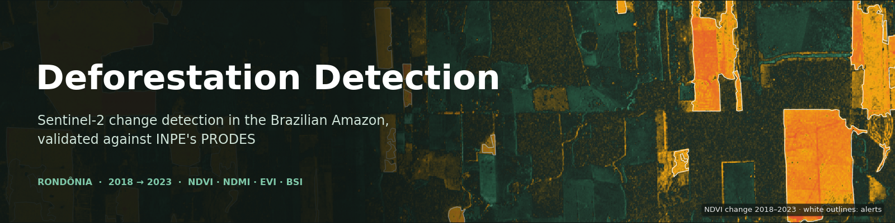
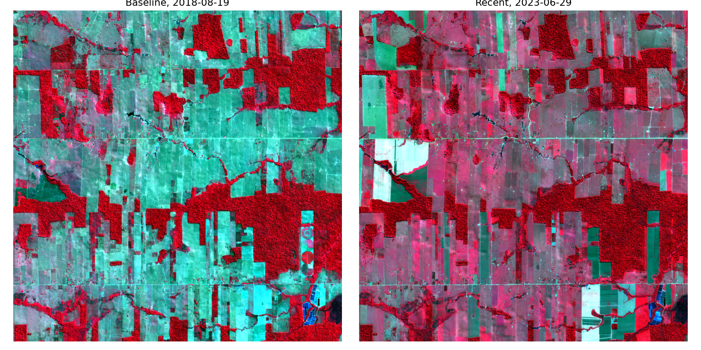
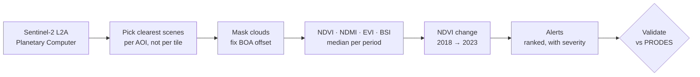
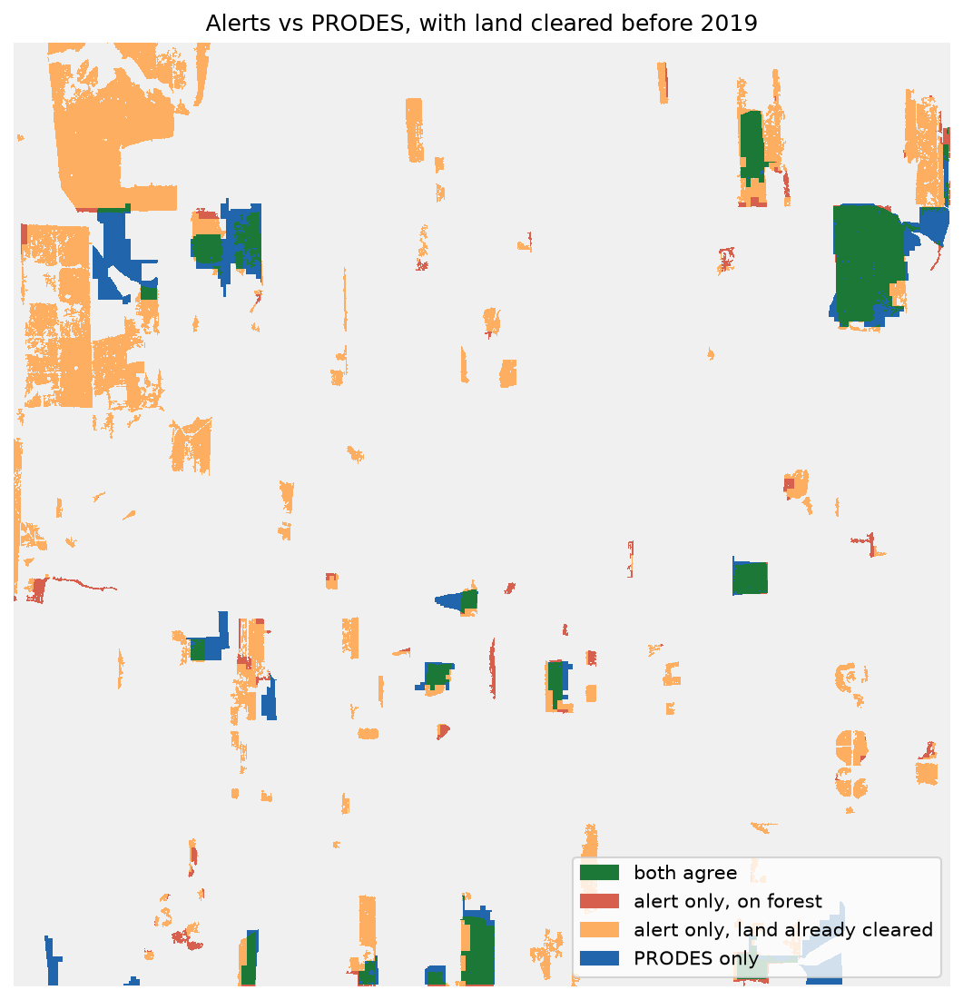
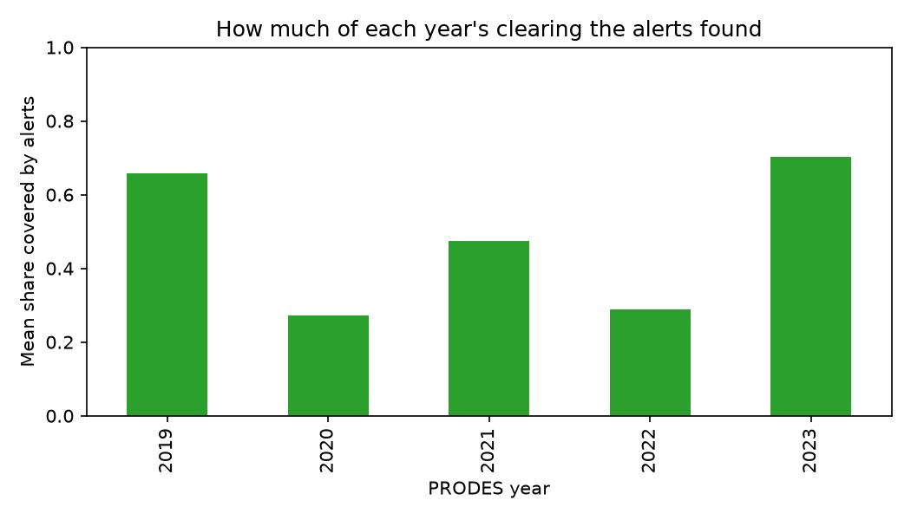
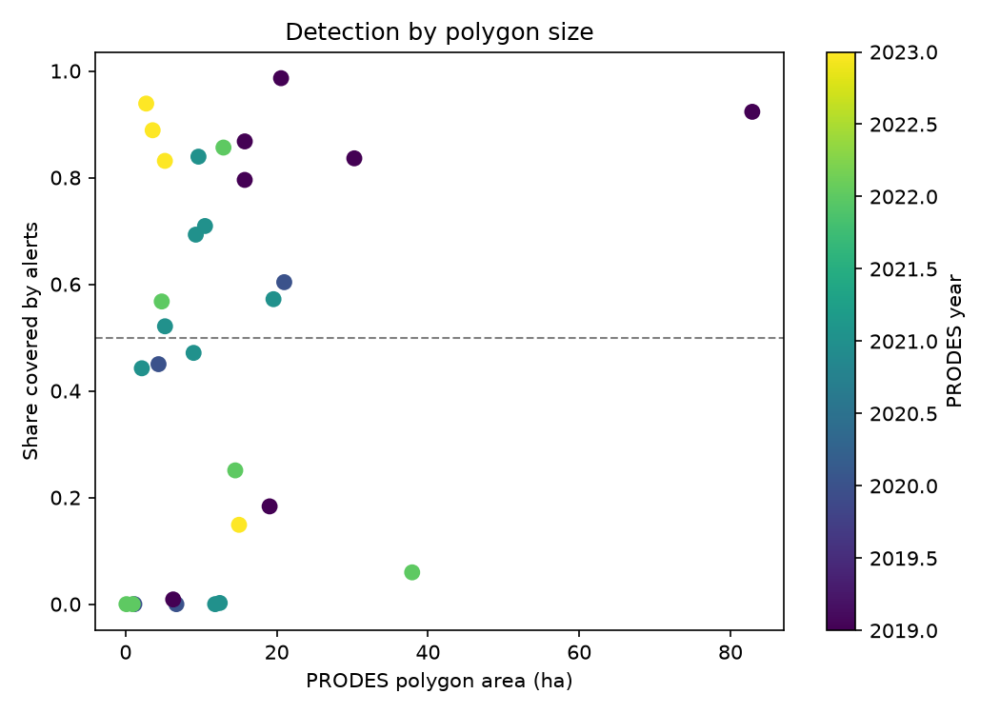

<p align="center">
  
</p>

<p align="center">
  
  
  
  
  
</p>

<p align="center">
  <b>Where did the forest go, and how far can a satellite-based answer be trusted?</b>
</p>

---

This project detects forest cover loss in the Brazilian Amazon from Sentinel-2 imagery, then checks the detections against **PRODES**, INPE's official deforestation map. The goal is to measure where the detections agree with PRODES, where they disagree, and *why*.

The study area is a 10 × 10 km window in the Rondônia deforestation arc. Two dry seasons are compared, **June–September 2018** and **June–September 2023**. The vegetation lost between them becomes a ranked list of areas to inspect.

## At a glance

<table>
  <tr>
    <td align="center"><b>81.7%</b><br><sub>of alerts on land PRODES still monitors match a mapped clearing</sub></td>
    <td align="center"><b>58.5%</b><br><sub>of PRODES 2019–2023 clearing area detected</sub></td>
    <td align="center"><b>93%</b><br><sub>of unconfirmed alerts fall on land already cleared before 2019</sub></td>
    <td align="center"><b>16 / 9 / 5</b><br><sub>PRODES clearings found / partly found / missed, of 30</sub></td>
  </tr>
</table>

<p align="center">
  <br>
  <sub><b>Same area, five years apart.</b> False colour (NIR, red, green): dense forest is deep red, pasture and bare soil are pale green or white.</sub>
</p>

## How it works



1. **Scene selection.** The pipeline searches Sentinel-2 L2A on Microsoft Planetary Computer and places the AOI well inside a single satellite swath. For each period it keeps the five clearest scenes, judged by the share of usable pixels *inside the AOI* (SCL band) rather than by tile-level cloud cover.
2. **Cleaning.** Clouds, shadows and missing data are masked. The radiometric offset that ESA introduced with processing baseline 04.00 in January 2022 is also corrected. Planetary Computer does not apply this correction, and without it the 2023 scenes look brighter than the 2018 ones, which produces a vegetation loss that isn't there.
3. **Indices and change.** NDVI, NDMI, EVI and BSI are computed per scene, then combined into a median composite per period, and the two periods are differenced.
4. **Alerts.** Pixels whose NDVI drops by more than 0.25 are turned into polygons. A polygon becomes an alert if it covers at least half a hectare, its bare-soil index rises, and it does not touch water. Alerts are ranked by area and labelled by severity, with a plain-language summary.
5. **Validation.** The alerts are compared with PRODES 2019–2023 pixel by pixel and polygon by polygon. The comparison takes into account which land PRODES no longer monitors.

## Results

| Metric | Value |
|---|---:|
| Precision, whole AOI | 23.0% |
| Precision, where PRODES still monitors the land | **81.7%** |
| Recall | 58.5% |
| False positives on land already cleared before 2019 | 93% |
| AOI that was no longer primary forest in 2018 | 77.5% |
| Alerts | 129, covering 1,050 ha |

<p align="center">
  <br>
  <sub><b>Alerts vs PRODES.</b> Green: both agree. Blue: PRODES only. Red: alert on standing forest. Orange: alert on land PRODES stopped monitoring before 2019.</sub>
</p>

### Most of the disagreement is definitional

PRODES records only the **first clear-cut of primary forest**. Once it has recorded an area, it never maps that area again. In this AOI, 77% of the land was no longer primary forest by 2018. The alerts, by contrast, flag any strong drop in vegetation. As a result, most of what PRODES does not confirm (the orange in the map above) lies on pasture, cropland and secondary regrowth, land that PRODES no longer watches. These alerts are not *wrong*, but PRODES cannot judge them. On the land PRODES still monitors, more than four alerts out of five match a mapped clearing.

### The real limit is recall

The five clearings the alerts missed entirely have a mean NDVI change of about **−0.06**, so by 2023 their vegetation had largely grown back. Clearings that were found have a mean of −0.33. A comparison of two dates cannot see a clearing that has already recovered. With only four to nine clearings per year, there is too little data to say whether older clearings are missed more often.

<details>
<summary><b>Detection by year and by size</b></summary>
<br>
<p align="center">
  
  
</p>
</details>

All numbers and caveats are in [`outputs/validation_metrics.json`](outputs/validation_metrics.json). Run settings and the scene IDs used are in [`outputs/run_info.json`](outputs/run_info.json).

## Quick start

```bash
git clone https://github.com/AngelicaIseni/Deforestation-Detection.git
cd Deforestation-Detection
conda env create -f environment.yml
conda activate deforestation
jupyter lab
```

1. **`01_detection.ipynb`** needs internet access to Microsoft Planetary Computer (no account required). It writes everything to `outputs/`.
2. **Download PRODES once** from [TerraBrasilis](https://terrabrasilis.dpi.inpe.br/en/download-files/) (Legal Amazon → PRODES → vector, GeoPackage) and put it in `data/`. Check that the file name matches `PRODES_PATH` at the top of the validation notebook.
3. **`02_validation.ipynb`** reads only `outputs/` and `data/`, and downloads no imagery.

You don't need to run anything to explore the results. `outputs/` is committed, and `outputs/interactive_map.html` opens in any browser.

## Repository layout

```
├── 01_detection.ipynb      scene selection → cleaning → indices → change → alerts
├── 02_validation.ipynb     comparison with PRODES
├── utils.py                functions shared by both notebooks
├── environment.yml
├── assets/                 README images
├── outputs/
│   ├── figures/
│   ├── ndvi_change.tif                 NDVI change, Cloud Optimized GeoTIFF
│   ├── vegetation_loss.geojson         candidate polygons
│   ├── deforestation_alerts.geojson    ranked alerts
│   ├── interactive_map.html
│   ├── run_info.json                   AOI, scenes, thresholds, headline numbers
│   └── validation_metrics.json         validation results and caveats
├── archive/                first version, including a Prithvi-EO-2.0 experiment
├── learning/               study notes and exercises (LEARNING.md)
└── data/                   large inputs, not tracked
```

## Limitations

- **Two snapshots.** Comparing 2018 with 2023 shows only the net difference. Land that was cleared and regrew in between is invisible, and a clearing cannot be dated.
- **Hand-picked thresholds.** The NDVI drop, the bare-soil margin and the severity cut-offs are reasonable starting points, not values calibrated on this area.
- **One small AOI.** The AOI is 10 × 10 km of a landscape that was mostly cleared before 2008. Results may differ along intact forest frontiers.
- **The reference has its own scope.** PRODES works at 30 m with a 6.25 ha minimum and maps primary forest only.

## Roadmap

- [x] Detection pipeline with radiometric fix and cloud masking
- [x] Validation against PRODES, at pixel and polygon level
- [ ] **Foundation model.** Revisit the Prithvi-EO-2.0 comparison with correct input preparation, covering the whole AOI.
- [ ] **An assistant that knows how far to trust itself.** An MCP server that exposes the pipeline as tools, so a language model can answer questions about the alerts with real numbers and report the measured accuracy and caveats alongside them.
- [ ] A dense time series instead of two snapshots, and Sentinel-1 radar to see through clouds.

## Data and acknowledgements

- **Sentinel-2 L2A**, Copernicus programme (contains modified Copernicus Sentinel data, 2018 and 2023), accessed through [Microsoft Planetary Computer](https://planetarycomputer.microsoft.com/dataset/sentinel-2-l2a).
- **PRODES**, INPE, distributed through [TerraBrasilis](https://terrabrasilis.dpi.inpe.br/). See its [citation and licence page](https://terrabrasilis.dpi.inpe.br/en/citations-and-use-licence/) before reusing the data.

<p align="center"><sub>Made by <a href="https://github.com/AngelicaIseni">Angelica Iseni</a></sub></p>
